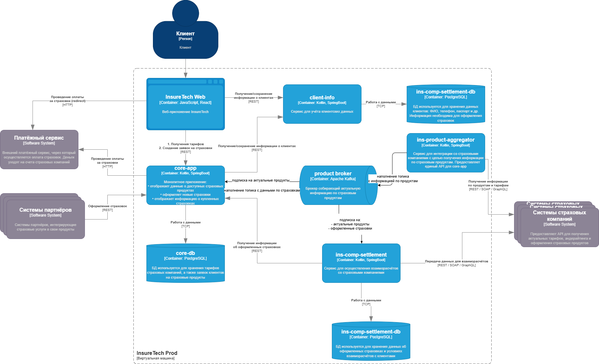

# Анализ проблем текущей схемы

Проблема с ins-product-aggregator

### Текущее решение

    core-app и ins-comp-settlement получают данные о доступных продуктах через REST API сервиса    ins-product-aggregator. В момент вызова он:

    запрашивает информацию из всех страховых компаний (сейчас их пять),
    агрегирует её в единый список,
    возвращает этот список в рамках того же синхронного запроса.

    Чтобы ускорить работу сервисов, при изначальном проектировании команда решила хранить локальные реплики данных о продуктах и тарифах в сервисах core-app и ins-comp-settlement.
    Сервис core-app осуществляет запрос к ins-product-aggregator раз в 15 минут, а ins-comp-settlement — раз в сутки (ночью), при формировании реестра оформленных страховок. Иногда команда сталкивается с ошибками взаимодействия между этими сервисами. Они связаны с задержками ответов или ошибками при взаимодействии с API страховых компаний.
    Дополнительно сервис ins-comp-settlement раз в сутки осуществляет запрос в core-app по REST API для получения всех оформленных за день страховок. Эти данные он использует. 
    В ближайшее время InsureTech планирует подписать агентское соглашение ещё с пятью страховыми компаниями.

**Диаграмма текущего решения**:
[C4 контейнеры](InsureTech_C4_сontainer-diagram.drawio)

### Анализ проблем

- взаимодействие синхронное. При проблемах на стороне любого API одной из внешних страховых компаний вся синхронная операция может падать.
- указано, что `команда решила хранить локальные реплики данных о продуктах и тарифах в сервисах core-app и ins-comp-settlement`. Реализация никак не отражена ни на диаграмме ни в описании. Непонятен принцип работы.
- не вполне понятна согласованность данных в момент ночного обновления данных (при формировании реестра оформленных страховок). Судя по всему одновременно сервис *ins-comp-settlement* и обновляет данные по продуктам из *ins-product-aggregator*, и идет в *core-app* за данными всех оформленных за день страховок. Непонятна корректность работы например при проблемах на стороне внешних API и соответственно отсутствии обновления со стороны *ins-product-aggregator*
- увеличение количества внешних API при текущей схеме будет только увеличивать уже обозначенные проблемы.

### Предлагаемое решение

**Диаграмма предлагаемого решения**:
[C4 контейнеры](InsureTech_C4_сontainer-diagram_to_be.drawio)

1. Изменение сервиса *ins-product-aggregator*. С REST API адаптера для вызова внешних API на самостоятельный сервис аггрегатор данных:
 - При такой логике не вижу смысла в коллекционировании сервисом *ins-product-aggregator* ответов от всех внешних API внутри одной операции. Реализация независимых запросов к отдельным API уменьшит вероятность неуспешных операций и увеличит среднюю скорость обновления данных по продуктам в системе.
 - необходимо реализовать публикацию данных по продуктам из *ins-product-aggregator* в брокер
 - в качестве брокера используем Kafka. В таком случае сервисы смогут считывать данные из топиков с той периодичностью, с которой им необходимо
 - В данном потоке событий использование Transactional Outbox избыточно. Процесс обновления данных по продуктам вполне сочитается с Eventual Consistency

2. Ежедневное обновление данных по оформленным страховкам из *core-app* в *ins-comp-settlement*:
- Использование брокера при озвученных требованиях на данный момент выглядит избыточно. решение с ежедневным вызовом REST api *core-app* не вызывает нареканий.
- Но если будет принято решение о необходимости формирования "живого" отчета сервисом *ins-comp-settlement*, то возможна реализация решения в котором *core-app* будет публиковать сообщения о сформированных страховках в соответствующий топик брокера, а *ins-comp-settlement* будет их получать по мере поступления
- при данной реализации уже будет необходимо использовать паттерн Transactional Outbox при публикации сообщений из *core-app*, так как нельзя недопускать несогласованности данных между данными о оформлении страховки в *core-app* и получением этой информации в *ins-comp-settlement*.

**Вывод**: Первый пункт считаю необходимым для успешной работы и дальнейшего масштабирования проекта. Второй на данном этапе избыточен